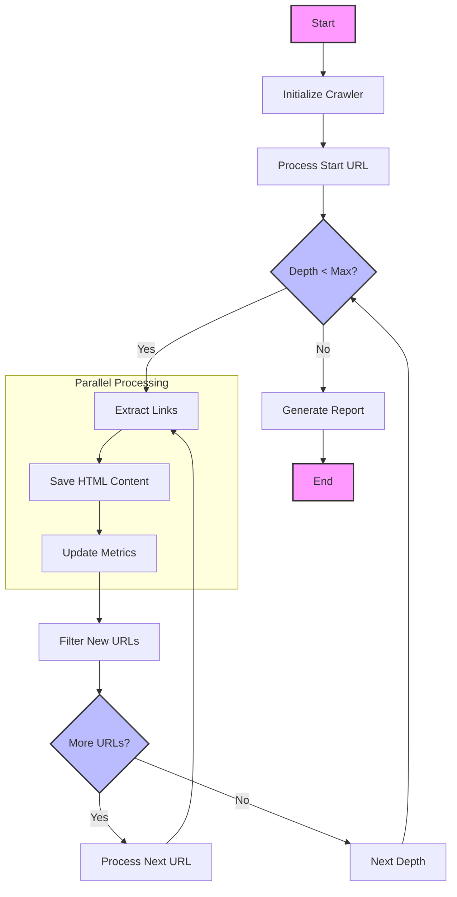

# Async Web Crawler

A high-performance asynchronous web crawler built with Python and Prefect for efficient web scraping and analysis. The crawler uses Prefect's workflow orchestration to manage parallel task execution, provide robust error handling, and visualize the crawling process.

## Features

- Built on Prefect for workflow orchestration and monitoring
- Asynchronous crawling using `asyncio` and `aiohttp`
- Configurable crawl depth
- Parallel URL processing with concurrency control
- Automatic URL normalization and deduplication
- HTML content storage with sanitized filenames
- Detailed crawl metrics in TSV format
- Robust error handling and retries
- Rate limiting to prevent server overload

## Requirements

- Python 3.8+
- Poetry for dependency management
- Prefect 2.x

## Installation

1. Extract the project:
```bash
unzip webcrawler-prefect.zip
cd webcrawler-prefect
```

2. Create and activate a virtual environment:
```bash
python -m venv .venv
source .venv/bin/activate  # On Windows use: .venv\Scripts\activate
```

3. Install dependencies using Poetry:
```bash
poetry install
```

## Prefect Setup

1. Start the Prefect server:
```bash
prefect server start
```

2. Open the Prefect UI:
   - Navigate to http://127.0.0.1:4200
   - The UI provides:
     * Real-time flow execution monitoring
     * Task status and metrics
     * Error logs and debugging information
     * Flow run history
     

## Usage

Run the crawler with a starting URL and maximum depth:

```bash
python main.py <url> <max_depth>
```

Example:
```bash
python main.py https://example.com 2
```

### Parameters

- `url`: Starting URL (must start with http:// or https://)
- `max_depth`: Maximum crawl depth (must be a positive integer)

### Monitoring

1. View active crawls in the Prefect UI:
   - Flow runs show real-time progress
   - Task states indicate success/failure
   - Logs provide detailed execution information

2. Check crawl results:
   - Crawled pages in `crawled_pages/` directory
   - Metrics report in `crawl_report.tsv`

### Output

The crawler generates two types of output:

1. Crawled Pages:
   - Stored in `crawled_pages/` directory
   - Filenames are sanitized versions of URLs
   - Content saved as HTML files

2. Crawl Report:
   - Saved as `crawl_report.tsv`
   - Contains metrics for each crawled URL:
     * URL
     * Depth
     * Internal/External link counts
     * Link ratio
     * Timestamp
     * Success/Error status

## Output Details

### 1. Crawl Report (crawl_report.tsv)

The crawler generates a detailed TSV report with the following fields:

| Field | Description |
|-------|-------------|
| url | The crawled URL |
| depth | Depth level from start URL (0 = start URL) |
| internal_links | Number of links to same domain |
| external_links | Number of links to other domains |
| total_links | Total number of links found |
| ratio | Ratio of internal to total links |
| timestamp | UTC timestamp of crawl |
| success | Whether crawl succeeded (True/False) |
| error | Error message if crawl failed |

Sample crawl report:
```
url	depth	internal_links	external_links	total_links	ratio	timestamp	success	error
https://python.org	0	45	12	57	0.789474	2023-09-20T15:30:45	True	
https://python.org/about	1	38	8	46	0.826087	2023-09-20T15:30:46	True	
https://python.org/downloads	1	52	15	67	0.776119	2023-09-20T15:30:47	True	
https://python.org/invalid	1	0	0	0	0.000000	2023-09-20T15:30:48	False	HTTP 404
```

### 2. Crawled Pages Directory (crawled_pages/)

HTML content from crawled pages is saved in the `crawled_pages/` directory. The directory structure is flat, with filenames derived from URLs:

```
crawled_pages/
├── python.org.html
├── python.org_about.html
├── python.org_downloads.html
└── ...
```

Each file contains:
- Raw HTML content of the page
- Original formatting preserved
- UTF-8 encoding

Example filename generation:
```
Original URL: https://python.org/about/apps
Saved as: crawled_pages/python.org_about_apps.html
```

## Workflow Diagram



## Project Structure

```
.
├── pyproject.toml          # Poetry configuration and dependencies
├── main.py                 # CLI entry point
└── src/
    ├── flows/             # Prefect flow definitions
    │   └── crawler_flow.py
    ├── tasks/             # Prefect task definitions
    │   ├── extract_links.py
    │   ├── process_depth.py
    │   └── save_page_content.py
    └── utils/             # Utility functions
        └── url.py
```

## Prefect Configuration

- Flow orchestration using Prefect 2.x
- Task retries: 2 attempts with exponential backoff
- Real-time monitoring via Prefect UI
- Flow-level logging and metrics
- Task-level error handling

## Error Handling

- Automatic retries for failed tasks
- Specific handling for "Too many open files" error
- Graceful handling of HTTP errors
- URL validation and normalization
- All errors visible in Prefect UI

## Performance Considerations

- Uses asyncio for non-blocking I/O
- Implements concurrency control to prevent resource exhaustion
- Efficient URL deduplication
- Controlled parallel processing via Prefect task runners

## Note

For screenshots of the Prefect UI and more detailed documentation, please refer to the [Prefect Documentation](https://docs.prefect.io/).
